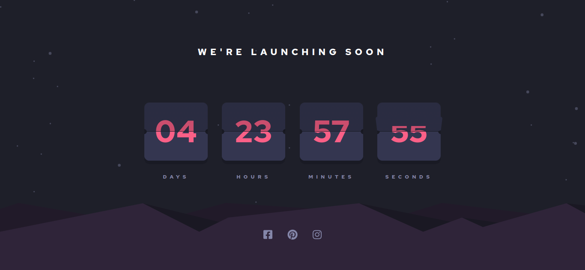
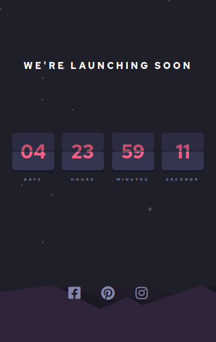

# Frontend Mentor Solution - Launch countdown timer

Solution for the challenge
[Launch countdown timer from Frontend Mentor](https://www.frontendmentor.io/challenges/launch-countdown-timer-N0XkGfyz-)
powered by `create-react-app`, and deployed with [Netlify](https://www.netlify.com/).

[See the deployed app here.](https://goofy-euler-3a0cac.netlify.app/)

## Table of contents

- [Overview](#overview)
  - [The chanllenge](#the-challenge)
  - [Screenshot](#screenshot)
  - [Links](#links)
- [My process](#my-process)
  - [Built with](#built-with)
  - [Key features](#key-features)
  - [Continued development](#continued-development)
  - [Useful resources](#useful-resources)
- [Author](#author)
- [Acknowledgments](#acknowledgments)

## Overview

### The challenge

As appears in the challenge description:

> Users should be able to:
> - See hover states for all interactive elements on the page.
> - See a live countdown timer that ticks down every second.
> - **Bonus:** When the time changes, makethe card flip from the middle.

Actually, the last requeriment (the bonus), is the real change here.

### Screenshot

Mobile view of the final app:

And the desktop view:

### Links

- Solution URL: [Github repo](https://github.com/Atlas6174/launch-countdown-timer-main)
- Live Site URL: [Live site on Netlify](https://goofy-euler-3a0cac.netlify.app/)

## My process

### Built with

In general, the app was built with `create-react-app` and styled with
[styled-components](https://styled-components.com/). Of course, I use
some basic features from CSS, like **Flexbox**, **keyframes** and properties
related to 3d animations.

### Key features

I started creating a boilerplate, with the structure of my components. After
some meditation, and having the structure ready, I developed the background
(specifically the layers; one for the color, one for the stars and one for
the hills). With that piece done, I focused on the `FlipDown` component,
implementing the styles with some hardcoded values for the content.

I continue with the `Counter` component, adding the logic of the countdown
and ading some space and positions to the `FlipDown`s.

The `Media` component wasn't difficult in any way.

The most difficult part of developing this app, was the animation. Each
`FlipDown` component, has 4 different cards:

- 2 cards for the upper half of the component, where one of those is dinamic
and implements the falling down animation. This card falls until it reaches
the -90deg of incline.

- 2 cards for the lower half of the component, where one of those is dinamic
but, in this case, the dinamic card starts having a 90deg inclination, being
invisible for the user, and appearing when the dinamic upper card reaches the
-90deg of incline.

The main idea of this behavior come from
[this codepen](https://codepen.io/liborgabrhel/pen/JyJzjb?editors=0110).
Take a look.

### Continued development

Maybe refactor the styles, this is my first time using styled components.

It would be great to use `animate.js` for the animations.

### Useful resources

- [css-tricks](https://css-tricks.com/) - I've visited css-tricks in several
occasions. Excellent resource.
- [3D card, by w3schools](https://www.w3schools.com/howto/howto_css_flip_card.asp) - 
Useful to understand some 3d properties of css.
- [Codepen from Libor Gabrhel](https://codepen.io/liborgabrhel/pen/JyJzjb?editors=0110) -
Just awesome. This component was very useful, and I don't know if I would found
the way to solve this without this codepen. Take a look at his work.

## Author

- Githup: @github.com/Atlas6174

## Acknowledgments

The work founded in css-tricks, w3schools but specially,
[this codepen](https://codepen.io/liborgabrhel/pen/JyJzjb?editors=0110)
from [Libor Gabrhel](https://codepen.io/liborgabrhel).
